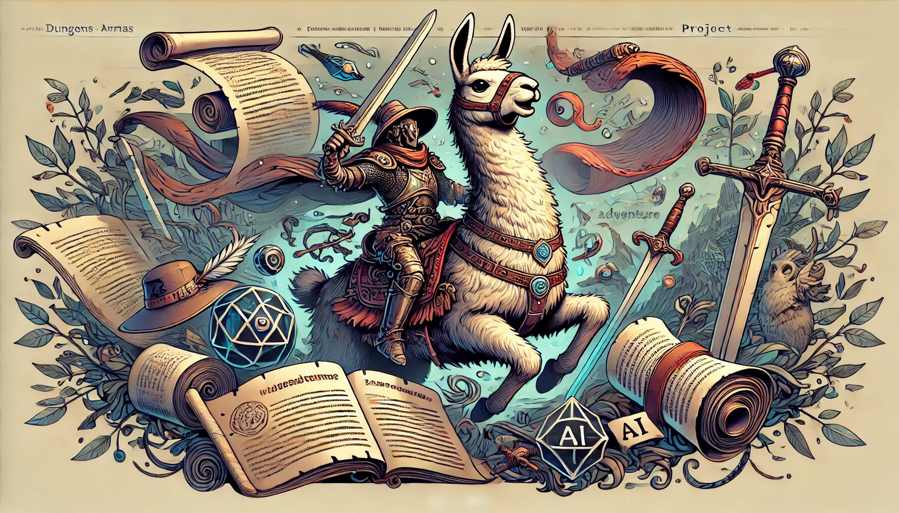
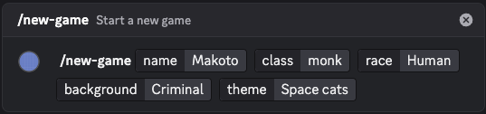

<p align="center">

</p>


<!-- [](https://crates.io/crates/my_crate) -->
<!-- [](https://docs.rs/my_crate) -->
<!-- [](https://github.com/Fomiller/dungeons-and-llamas/actions) -->
<!-- [](https://codecov.io/gh/myusername/myrepo) -->

<!-- [](https://crates.io/crates/my_crate) -->


# Dungeons and Llamas
## Description
A serverless Discord bot written in Rust, leveraging AWS services such as API-Gateway, DynamoDB, Lambda, Bedrock and more! This bot creates dynamic text-based adventures, powered by LLMs, allowing users to experience unique, AI-generated stories each time they play.

Dungeons and Llamas revolves around leveraging discords api as a UI. The player will have a variety of commands avaialable to them while playing. 

To start a new game the user will use the `/new-game` command where they will fill in some base values about their character.

The user can fill in the theme field with what ever they want and the ai will create content related to the theme. 

Once a new game is started the user will be presented with a start to their campagin and the choice of 3 different weapons the begin their adventure with


Currently there are 3 different scenarios that can be generated 
Battle

Shop

Rest


## Installation
To add the Dungeons-and-Llamas bot to your discord follow this [link](https://discord.com/oauth2/authorize?client_id=1288579466242560000) 

## Commands
Working Commands are currently 
- `/new-game`
    - creates a new game, currently writes all records to dynamodb for player inventory,
    example:
    ```json
    {
      "UserId": {
        "S": "623440987023810570"
      },
      "StateComponent": {
        "S": "sXDwyrS6M8O#Game#Player#Inventory#Item#Armor#Equipped#Shield"
      },
      "State": {
        "NULL": true
      }
    }
    ```

## Progress
- [x] create discord bot lambda
- [x] create command manager lambda
- [x] create dungeons and llamas api (api to handle all interactions with game logic)
- [x] dynamodb data modeling for player inventory
- [x] integrate bot -> api -> database
- [ ] build out further data models for GAME, ENEMY, ROUNDS, LEVELS, NPC
- [ ] add additional records for GAME, ENEMY, ROUNDS, LEVELS, NPC components to dynamodb on `/new-game`
- [ ] integrate with Bedrock
- [ ] start releasing to production
- [ ] turn serverless discord bot infrastructure into a terraform module


## Developer Docs
- inital project setup commmands
```
doppler setup -p {project_name} -c {config_name}
```
* just Commands
    * just apply "module"
    * just build-lambdas
    * just deploy-lambdas


### Links
https://artefact2.github.io/llm-sampling/index.xhtml
