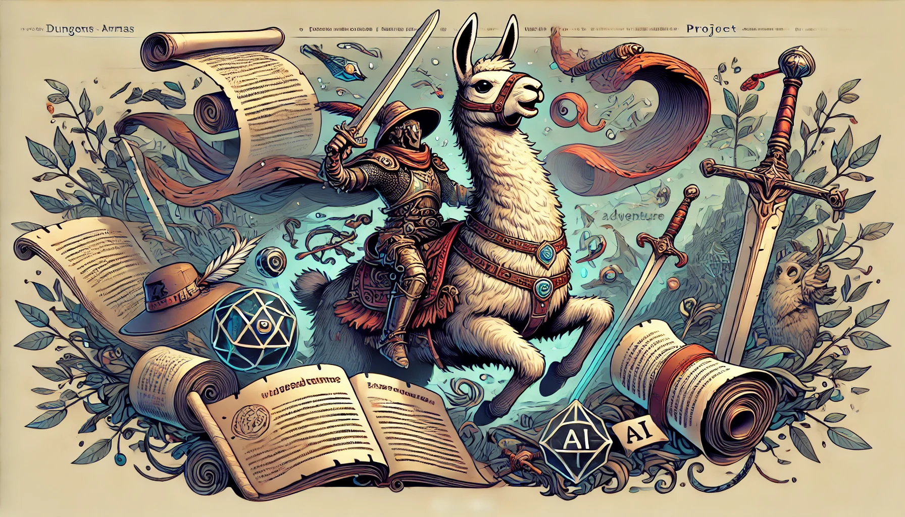

<p align="center">

</p>

# Dungeons-and-LLamas
## Description
A serverless Discord bot written in Rust, leveraging AWS services such as API-Gateway, DynamoDB, Lambda, Bedrock and more! This bot creates dynamic text-based adventures, powered by LLMs, allowing users to experience unique, AI-generated stories each time they play.

## Docs
inital project setup commmands
```
doppler setup -p {project_name} -c {config_name}
```
